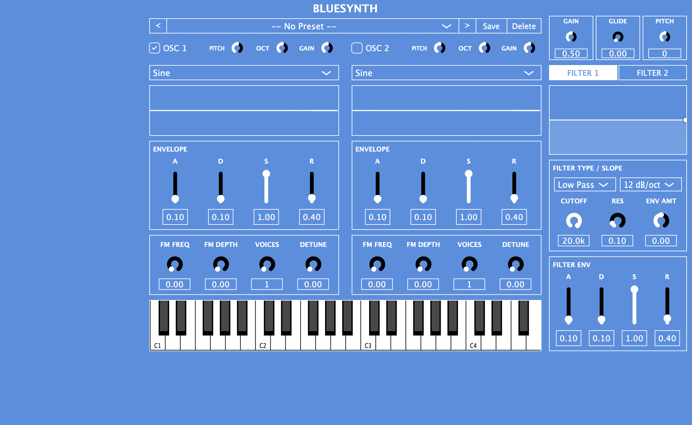

# BlueSynth

A dual-oscillator subtractive/FM synthesizer plugin with per-oscillator oscilloscopes, built in C++ with [JUCE](https://juce.com). Runs as **AU**, **VST3**, or a **standalone app** on macOS.



## Features

- **Live oscilloscopes** — one per oscillator, pitch-synced so the waveform stays the same size at any note or octave, with clip indicators on the outline (amber = oscillator maxed, red = output clipping)
- **Two independent oscillators**, each with 13 waveforms: Sine, Saw, Saw Inverse, Square, Triangle, Pulse 1, Pulse 2, Noise, Square (band-limited), Saw (band-limited), Rectified Sine, Trapezoid, and Stepped Saw
- **Filter panel** — tabbed FILTER 1/2, Low Pass / High Pass / Band Pass per oscillator, with a live frequency-response curve that sweeps in real time with the filter envelope and a dot marking the current cutoff
- **Per-oscillator FM**, unison up to 8 voices with detune, and ±4 octave / ±24 semitone tuning
- **Per-oscillator ADSR** amplitude envelope, plus an independent filter envelope
- **32-voice polyphony** with portamento/glide and a global pitch offset
- **Preset system** — save, load, and delete presets from within the plugin
- **On-screen piano** — 44 clickable keys (C2–G5), styled black-and-white to match the rest of the UI; plays through the same note path as MIDI input, so it works with no controller connected
- **Zero added latency** — no lookahead or internal buffering, so end-to-end latency is whatever your audio buffer is set to

## Requirements

- macOS with Xcode
- [JUCE](https://juce.com) 8.x — the project expects a sibling `JUCE` checkout. If yours lives elsewhere, open `BlueSynth.jucer` in the Projucer and re-save to regenerate the build files.

## Building

**Via Xcode** — open `Builds/MacOSX/BlueSynth.xcodeproj`, pick a scheme (`BlueSynth - AU`, `- VST3`, `- Standalone Plugin`, or `- All`), and build.

**From the command line:**

```bash
xcodebuild -project Builds/MacOSX/BlueSynth.xcodeproj \
           -scheme "BlueSynth - All" -configuration Release build
```

Plugins are copied to the standard system folders on build (`~/Library/Audio/Plug-Ins/VST3` and `.../Components`); the standalone app lands in `Builds/MacOSX/build/Release/`. Rescan plugins in your DAW to pick up a new build.

> If you add or remove source files, add them in `BlueSynth.jucer` and re-save with the Projucer — files added directly in Xcode are lost the next time the project is regenerated.

## Tech stack

**C++17** on **JUCE 8**, using the modules `juce_audio_basics`, `juce_audio_devices`, `juce_audio_formats`, `juce_audio_plugin_client`, `juce_audio_processors`, `juce_audio_utils`, `juce_core`, `juce_data_structures`, `juce_dsp`, `juce_events`, `juce_graphics`, `juce_gui_basics`, `juce_gui_extra`, and `juce_animation`.

- `juce::Synthesiser` / `juce::SynthesiserVoice` for voice management and polyphony
- `juce::dsp` for oscillators, state-variable TPT filters, and gain processing
- `AudioProcessorValueTreeState` (APVTS) for parameter state, presets, and host automation
- Lock-free ring buffers (`juce::AbstractFifo`) for audio-thread → UI-thread metering, feeding both the oscilloscopes and the live filter-curve dot without locks or allocations on the audio thread
- `juce::MidiKeyboardComponent` / `MidiKeyboardState` for the on-screen piano — merged into the same `MidiBuffer` host-sent MIDI arrives in, so the synth can't tell a click from a real note

## Project structure

```
Source/
  PluginProcessor.*      Parameter layout, MIDI/parameter → voice routing, clip detection
  PluginEditor.*         Top-level UI and layout
  SynthVoice.*           Per-voice DSP: oscillators, unison, filters, envelopes, mixing
  SynthSound.h           Marker sound class for juce::Synthesiser
  Data/
    OscData.*            Oscillator and waveform generation (13 waveforms)
    FilterData.*         State-variable (TPT) filter wrapper
    AdsrData.*           ADSR envelope wrapper
    PresetManager.*      Preset save/load/delete
    VisualizerBuffer.*   Lock-free audio → UI hand-off for the scopes and filter curve
  UI/
    OscilloscopeComponent.*  Pitch-synced, triggered oscilloscope
    FilterComponent.*        Filter type/cutoff/resonance/env-amount controls
    FilterCurveComponent.*   Live frequency-response curve + cutoff dot
    FilterPanelComponent.*   Tabbed FILTER 1/2 side panel hosting the above two
    ADSRComponent.*          Envelope panel (used for both amp and filter envelopes)
    OscComponent.*           FM and unison controls panel
    PresetComponent.*        Preset browser
    AppFont.h                Shared UI font helper
```

## Roadmap

- **AI preset generation** — describe a sound in plain language ("warm detuned pad", "gritty bass") and have a chatbot build the patch. Every parameter already lives in an `AudioProcessorValueTreeState` and presets are plain XML, so a generated patch is just a preset file the existing `PresetManager` can load.
- **Fully band-limited oscillators** — Square BL and Saw BL exist alongside the originals; extend the same treatment to the remaining naive waveforms to remove aliasing everywhere
- **LFO section** for modulating pitch, filter cutoff, and amplitude
- **Effects** — reverb, delay, chorus
- **Factory preset bank** shipped with the plugin

## License

Not yet licensed. Built with [JUCE](https://juce.com), which is separately licensed under its own terms.
